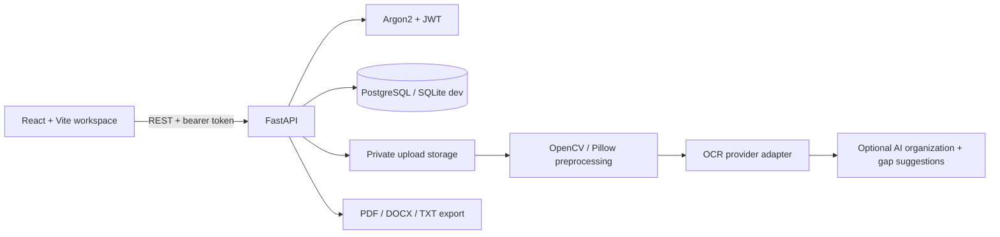

# Architecture

```mermaid
flowchart LR
  UI[React + Vite workspace] -->|REST + bearer token| API[FastAPI]
  API --> AUTH[Argon2 + JWT]
  API --> DB[(PostgreSQL / SQLite dev)]
  API --> FS[Private upload storage]
  FS --> PRE[OpenCV / Pillow preprocessing]
  PRE --> OCR[OCR provider adapter]
  OCR --> LLM[Optional AI organization + gap suggestions]
  API --> EXP[PDF / DOCX / TXT export]
```

Backend owns file access and secrets. The UI receives document metadata and processed text. Every document-scoped operation must verify owner ID.
